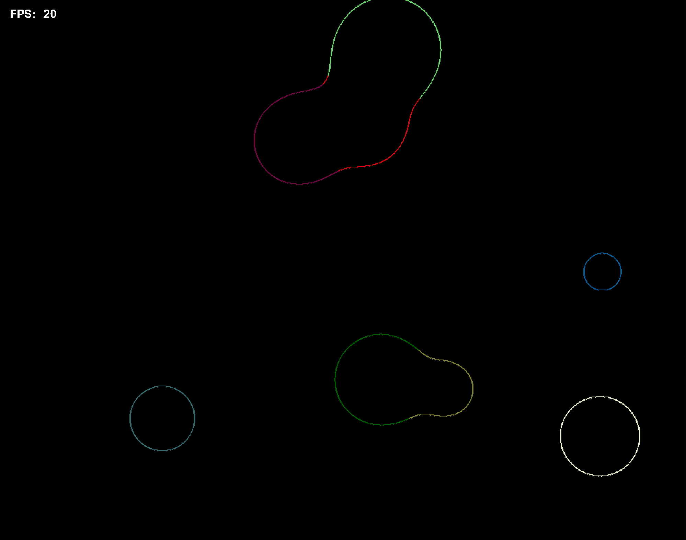

# Marching-Metaballs
A visual demonstration of metaballs using the marching squares algorithm.

A scalar field is calculated where each ball contributes according to its distance from a given point. The scalar field is then used to determine the contours that represent the boundaries of the balls.

Interestingly, the implicit function used for metaballs is the same field function appearing in electromagnetic and gravitational theory.



To run,
```bash
pip install -r requirements.txt
python metaballs.py
```